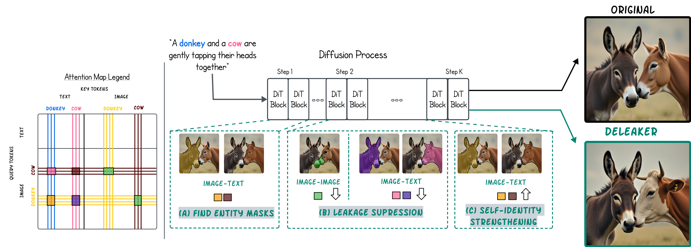

# DeLeaker

Official implementation of **["DeLeaker: Dynamic Inference-Time Reweighting For Semantic Leakage Mitigation in Text-to-Image Models"](https://arxiv.org/abs/2510.15015)** (ICLR 2026). 📄 [Paper](https://arxiv.org/abs/2510.15015) · 🌐 [Project page](https://venturamor.github.io/DeLeaker/) · 🤗 [Dataset](https://huggingface.co/datasets/tokeron/slim-dataset)

## Abstract

> Text-to-Image (T2I) models have advanced rapidly, yet they remain vulnerable to *semantic leakage*, the unintended transfer of semantically related features between distinct entities. Existing mitigation strategies are often optimization-based or dependent on external inputs. We introduce **DeLeaker**, a lightweight, optimization-free inference-time approach that mitigates leakage by directly intervening on the model's attention maps. Throughout the diffusion process, DeLeaker dynamically reweights attention maps to suppress excessive cross-entity interactions while strengthening the identity of each entity. To support systematic evaluation, we introduce **SLIM** (Semantic Leakage in IMages), the first dataset dedicated to semantic leakage, comprising 1,130 human-verified samples spanning diverse scenarios, together with a novel automatic evaluation framework. Experiments demonstrate that DeLeaker consistently outperforms all baselines, even when they are provided with external information, achieving effective leakage mitigation without compromising fidelity or quality. These results underscore the value of attention control and pave the way for more semantically precise T2I models.

> **Leakage example.** A prompt for *a cat and a cheetah* tends to produce a "cheet-cat" — cheetah spots bleeding onto the cat. DeLeaker uses the model's own attention to localize each entity, then suppresses cross-entity image–image and image–text attention while it denoises.

## Method



At every diffusion step DeLeaker (a) builds per-entity attention masks from the model's own image–text attention, (b) suppresses cross-entity attention so features stop bleeding across entities, and (c) strengthens self-entity attention so each entity preserves its own identity.

## Install

Python 3.10, CUDA 11.8 GPU. **Install Torch with matching CUDA libs first** — the default PyPI wheel ships an incompatible CUDA bundle that breaks at import on many systems:

```bash
git clone git@github.com:tokeron/DeLeaker.git
cd DeLeaker

# 1. Torch + CUDA 11.8 (skip if you already have a working torch install):
pip install --index-url https://download.pytorch.org/whl/cu118 torch==2.6.0

# 2. The package + the rest of its deps:
pip install -e .
```

**FLUX.1-dev is a gated model.** Before the first run you must:

1. Create a Hugging Face account and accept the license at https://huggingface.co/black-forest-labs/FLUX.1-dev.
2. Authenticate locally:
   ```bash
   huggingface-cli login
   ```

For the comparison-grid example that pulls prompts from `tokeron/slim-dataset`:

```bash
pip install datasets
```

## Quick start

A self-contained one-prompt example lives at the repo root in two formats:

- [`quickstart.py`](quickstart.py) — runs out of the box with a default bat/owl prompt, or pass your own:
  ```bash
  python quickstart.py
  python quickstart.py --prompt "A cow and a horse are sitting together in a bus." --entities "cow,horse"
  python quickstart.py --prompt "..." --entities "x,y" --seed 42 --no-use-deleaker
  ```
- [`quickstart.ipynb`](quickstart.ipynb) — same thing in a Jupyter notebook.

Each entity in `--entities` must appear verbatim in `--prompt`. Output is written to `out.png`.

Or do it inline:

```python
import torch
from deleaker import DeleakerFluxPipeline, DeleakerConfig

pipe = DeleakerFluxPipeline.from_pretrained(
    "black-forest-labs/FLUX.1-dev", torch_dtype=torch.float16,
).to("cuda")

image = pipe(
    prompt="A bat and an owl are perched side by side on a tree branch.",
    entities=["bat", "owl"],
    num_inference_steps=20, guidance_scale=3.5,
    height=512, width=512,
    generator=torch.Generator("cuda").manual_seed(200),
).images[0]
image.save("out.png")
```

The `entities` you pass must appear verbatim in the prompt. Pass a `DeleakerConfig(...)` to tune the intervention; defaults reproduce the paper figures.

## Examples

| Script | What it does |
| --- | --- |
| [`examples/vanilla_inference.py`](examples/vanilla_inference.py) | Plain FLUX.1-dev, no deleaker (baseline) |
| [`examples/deleaker_inference.py`](examples/deleaker_inference.py) | Same prompt + seed with deleaker on |
| [`examples/generate_and_compare.py`](examples/generate_and_compare.py) | Generate vanilla **and** deleaker side-by-side, build comparison grids. Two modes — see below. |

### `generate_and_compare.py` — dataset mode vs custom mode

**Dataset mode (default).** Use prompts that the published `tokeron/slim-dataset` already labelled as leaking on FLUX.1-dev. The script pulls every seed listed for each selected prompt and produces a 2-panel grid per (prompt, seed): `vanilla | deleaker`. The HF reference image is still saved alongside (`seed_XXXX_reference.png`) for spot-checks.

```bash
# Run on the default selection of dataset prompts (indices 1, 3, 4):
python examples/generate_and_compare.py

# Pick your own prompt indices (0-based, in order of first appearance):
python examples/generate_and_compare.py --hf-indices 5,6,8
```

Stick with the default 512×512 in dataset mode — the references on the Hub were generated at that resolution, and running at a different size would produce wholly different compositions for the same seed.

**Custom mode.** Provide your own prompt and entities. The script generates vanilla + deleaker for each seed and produces the same 2-panel `vanilla | deleaker` grid.

```bash
python examples/generate_and_compare.py \
    --prompt "A bat and an owl are perched side by side on a tree branch." \
    --entities "bat,owl" \
    --seeds 100,200,300
```

Each entity passed via `--entities` must appear verbatim in the prompt. Default seeds are `100,200,300`; default resolution is 512×512. Add `--height 1024 --width 1024` to render at 1024 (slower, more VRAM, generally better-looking).

**Output layout** (both modes):
```
examples/output/<subdir>/
    <prompt_idx>_<prompt_slug>/
        prompt.txt
        seed_0100_vanilla.png
        seed_0100_deleaker.png
        seed_0100_compare.png    # 2-panel pair grid (vanilla | deleaker)
        ...
        grid.png                 # master grid: rows = seeds
```
`<subdir>` defaults to `hf_dataset` in dataset mode and `custom` in custom mode; override with `--out-subdir`.

## Dataset

[`tokeron/slim-dataset`](https://huggingface.co/datasets/tokeron/slim-dataset) on Hugging Face — 1,305 prompts that trigger leakage on FLUX.1-dev, with entity annotations and the seed that produced the original leaky image. Schema:

| column | type | description |
| --- | --- | --- |
| `image` | PIL | the leaky image generated by vanilla FLUX.1-dev |
| `prompt` | str | full untruncated prompt |
| `entities` | str | comma-separated, e.g. `"cat, cheetah"` |
| `seed` | int | original generation seed |
| `dataset` | str | source split: `two_entities`, `animal_triplets`, `fruit_n_veg_triplets` |
| `model` | str | `"FLUX.1-dev"` |
| `leakage` | bool | always `True` |

```python
from datasets import load_dataset
ds = load_dataset("tokeron/slim-dataset", split="train")
print(ds[0]["prompt"], ds[0]["entities"], ds[0]["seed"])
```

## How it works

For each attention layer (per timestep × per block):

1. Project Q/K/V and compute the pre-softmax attention logits.
2. Build per-entity image masks by thresholding image→entity-text attention at `mean + std_mul_text * std`. Smooth via morphological open/close.
3. **Image–text weakening:** add `-inf` to logits where entity-A image patches attend to entity-B text tokens (and vice versa).
4. **Image–text strengthening:** multiply self-entity image→text logits by `k_strength`.
5. **Image–image weakening:** add `-inf` to logits between entity-A image patches and entity-B image patches above `mean + std_mul_image_image * std`.
6. Re-softmax the edited logits and continue.

A rolling weighted average of attention is kept across blocks (`use_history=True`) so the entity masks are temporally smooth — without it the per-block masks are too noisy.

## Knobs (`DeleakerConfig`)

```python
DeleakerConfig(
    use_deleaker=True,            # master switch
    std_mul_text=1.0,             # threshold for image-text entity mask (mean + k*std)
    std_mul_image_image=1.0,      # threshold for image-image cross-entity mask
    k_strength=1.2,               # self-entity image-text boost
    start_aggregating_from=12,    # block-step at which history starts
    stop_aggregating_at=684,      # block-step at which history stops
    start_intervention_from=18,   # block-step at which attention is edited
    stop_intervention_at=1140,    # block-step at which editing stops
    use_history=True,
    use_binary_history=False,
    history_sliding_window=10,
    do_smoothing=True,            # morphological clean of entity masks
    # Ablations:
    do_image_image=True,
    do_image_text_strengthening=True,
    do_image_text_weakening=True,
    do_text_text_weakening=False,
    num_text_tokens=256,
)
```

The window indices are absolute *block-step* values: `step_index * 57 + block_offset`, where 57 is FLUX's per-step block count (19 double + 38 single). The defaults span steps 0–20.

## Licenses

- DeLeaker code: [Apache-2.0](LICENSE).
- FLUX.1-dev model weights: [FLUX.1 [dev] Non-Commercial License](https://huggingface.co/black-forest-labs/FLUX.1-dev/blob/main/LICENSE.md). Required for commercial use; see Black Forest Labs.
- `tokeron/slim-dataset` is a derivative of FLUX.1-dev outputs; users must comply with the FLUX.1-dev license for any downstream use.

## Citation

```bibtex
@inproceedings{ventura2025deleaker,
  title={Deleaker: Dynamic inference-time reweighting for semantic leakage mitigation in text-to-image models},
  author={Ventura, Mor and Toker, Michael and Patashnik, Or and Belinkov, Yonatan and Reichart, Roi},
  booktitle={The Fourteenth International Conference on Learning Representations},
  year={2026}
}
```
